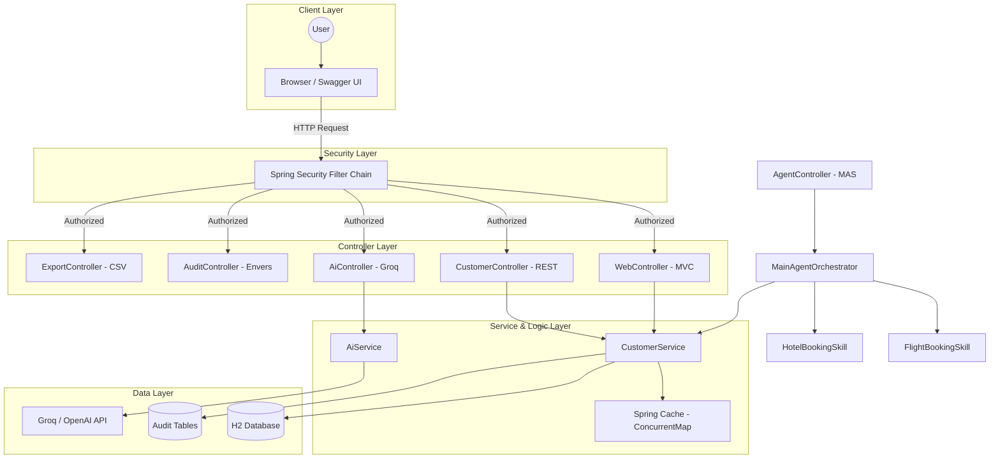

# Customer CRM Project Documentation (Best Practices)

This application is a demonstration of modern Java and Spring Boot development approaches, combining best practices from provided materials.

## Technology Stack
- **Java 21**: Utilizing Virtual Threads (Project Loom) for high performance with blocking I/O.
- **Spring Boot 3.2+**: The core of the application.
- **Spring AI**: Integration with Groq/OpenAI for customer notes analysis.
- **Spring Data JPA**: Database interaction (H2 in-memory for demo, MySQL support).
- **Thymeleaf**: Template engine for server-side UI rendering.
- **SpringDoc OpenAPI (Swagger)**: Automated REST API documentation.
- **Lombok**: Reducing boilerplate code.
- **Spring Security**: Secure API endpoints and web interface.
- **Hibernate Envers**: Full audit history for entities.

## Key Features
1. **API Versioning**: All endpoints are prefixed with `/api/v1/`.
2. **Keyset Pagination (Seek Method)**: Efficient pagination for large datasets (O(log N) instead of O(N)).
3. **Caching**: Multi-level caching (Spring Cache) with manual clear support.
4. **Security**: Protected endpoints via Spring Security (admin/admin).
5. **Auditing**: Full history of customer changes (Hibernate Envers).
6. **Multi-Agent System (MAS)**: Autonomous agent system with RAG and specialization.
7. **AI Integration (Groq/OpenAI)**: LLM integration for note summarization and token usage tracking.
8. **Quick Search**: Dynamic search with Debounce.
9. **Export**: Data export in CSV format.
10. **Virtual Threads**: Enabled via `spring.threads.virtual.enabled=true`.

## Security and API Access

The application features a comprehensive security system based on **Spring Security**.

### Access Configuration
- **Public Endpoints**: 
  - Home Page (`/`)
  - Swagger UI (`/swagger-ui/**`)
  - JSON API Documentation (`/api-docs/**`)
  - Static Resources (CSS/JS)
- **Protected Endpoints**: All other requests (CRUD, Audit, Export, AI functions) require authentication.

### Credentials (Demo)
A demo user is created in-memory:
- **Username**: `admin`
- **Password**: `admin`

### Security Mechanisms
- **HTTP Basic**: Used for testing API via Swagger. Click the **Authorize** button in Swagger and enter credentials.
- **Form Login**: Used for web interface access.
- **CSRF**: Temporarily disabled to simplify POST/PUT/DELETE testing via Swagger.

## Architecture Diagram



---

## Project Structure

```text
src/main/java/com/example/customer/
├── agent/                      # Multi-Agent System (MAS)
│   ├── model/                  # Agent request/response models
│   ├── service/                # Main orchestrator and MAS controller
│   └── skills/                 # Specialized skills (flights, hotels)
├── ai/                         # Artificial Intelligence Integration
│   ├── CustomerAiController.java  # REST controller for AI features and stats
│   └── CustomerAiService.java     # Logic for LLM interaction (Groq/OpenAI)
├── config/                     # Configuration classes
│   ├── AuditConfig.java           # Hibernate Envers setup (Auditing)
│   ├── DatabaseSeeder.java        # Initial data seeding
│   └── SecurityConfig.java        # Spring Security and access setup
├── controller/                 # Application controllers
│   ├── AuditController.java       # API for change history
│   ├── AuthController.java        # API for authorization (Login/Register)
│   ├── CacheController.java       # API for administrative cache management
│   ├── CustomerController.java    # Core REST API (CRUD, pagination, search)
│   ├── ExportController.java      # API for data export (CSV)
│   └── WebController.java         # MVC controller for web UI (Thymeleaf)
├── dto/                        # Data Transfer Objects
│   └── CustomerDto.java           # Requests, responses, and audit models
├── entity/                     # Database entities
│   └── Customer.java              # Customer model with audit support
├── repository/                 # Data Access Layer
│   └── CustomerRepository.java    # Repo with Seek-pagination and audit support
├── service/                    # Business Logic
│   ├── CustomerService.java       # Core service (CRUD, caching, auditing)
│   └── ExportService.java         # Logic for CSV report generation
├── validation/                 # Custom validation
│   ├── CustomerNotesValidator.java
│   └── ValidNotes.java
└── Application.java            # Application entry point (@EnableCaching)

src/main/resources/
├── db/migration/               # Database migrations (Flyway)
├── templates/                  # HTML templates (Thymeleaf)
└── application.properties      # Global settings (DB, AI, Security, Cache)
```

---

## How to Run
1. Clone the repository.
2. Set environment variables for AI:
   ```bash
   export AI_API_KEY='your-groq-key'
   export AI_BASE_URL='https://api.groq.com/openai'
   export AI_MODEL='llama3-8b-8192'
   ```
3. Run via Maven:
   ```bash
   mvn spring-boot:run
   ```
4. Open [http://localhost:8080](http://localhost:8080).
5. Swagger documentation: [http://localhost:8080/swagger-ui.html](http://localhost:8080/swagger-ui.html). Credentials: `admin` / `admin`.

---

## Recent Updates

### Multi-Agent System (MAS) & RAG
Advanced agent-based system for business process automation:
- **Main Agent (Orchestrator)**: Coordinates tasks and utilizes RAG.
- **RAG (Retrieval-Augmented Generation)**: Agents fetch customer context and company rules before decision-making.
- **Specialized Skills**: `FlightBookingSkill` and `HotelBookingSkill` for external service simulation.
- **Training**: Support for Few-shot training via `/api/v1/agents/train`.
- **C4 Documentation**: Detailed MAS diagram in [docs/MAS_RAG_C4.md](docs/MAS_RAG_C4.md).

### Quick Search
Dynamic search in Web UI:
- **Debounce**: 300ms delay to prevent excessive requests.
- **AJAX**: Real-time table updates without page reload.
- **Instant Results**: Matches appear as you type.
