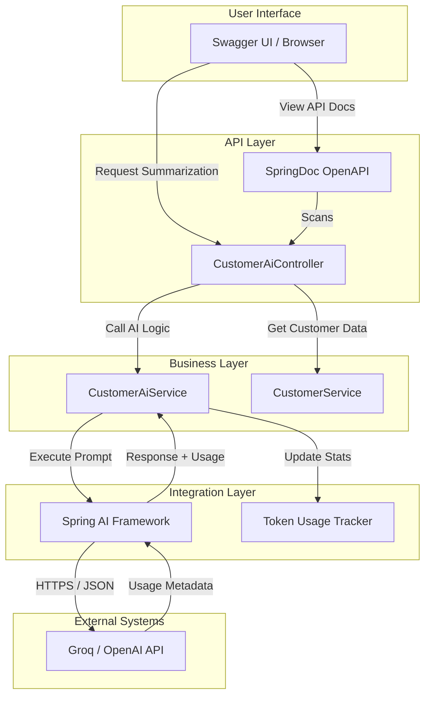

# C4 Model: AI & Swagger Integration

This document describes the AI integration and how it is exposed through Swagger (SpringDoc OpenAPI).

## Level 3: Component Diagram (AI Integration)

## AI Integration Details

### 1. Spring AI Configuration
The system uses `spring-ai-openai-spring-boot-starter` which is compatible with **Groq**'s OpenAI-compatible API.
- **Base URL**: Configured to `https://api.groq.com/openai` for high-speed inference.
- **Model**: Defaulting to `llama3-8b-8192` for optimal performance.

### 2. Token Usage Tracking
We implemented a custom tracking mechanism in [CustomerAiService.java](../src/main/java/com/example/customer/ai/CustomerAiService.java):
- **Mechanism**: Captures `Usage` metadata from `ChatResponse`.
- **Storage**: Thread-safe `ConcurrentHashMap` storing `TokenUsage` records per model.
- **Metrics**: Tracks `promptTokens`, `completionTokens`, and `totalTokens`.

### 3. Swagger (OpenAPI) Exposure
The AI features are documented using SpringDoc OpenAPI annotations:
- **Tags**: Organized under `Customer AI API`.
- **Operations**: 
  - `GET /api/v1/customers/{id}/ai/summarize`: Uses AI to condense customer notes.
  - `GET /api/v1/customers/{id}/ai/suggest-response`: Generates professional email drafts.
  - `GET /api/v1/customers/ai/usage`: Exposes real-time token metrics.

## Component Interaction Flow

1. **Discovery**: User opens Swagger UI and finds AI endpoints.
2. **Execution**: User provides a Customer ID and triggers an AI operation.
3. **Context Retrieval**: `CustomerAiController` fetches the customer's notes via `CustomerService`.
4. **AI Call**: `CustomerAiService` constructs a prompt and calls Groq via `Spring AI`.
5. **Usage Recording**: Upon receiving a response, the service extracts token count and updates the internal stats.
6. **Delivery**: The summarized text or suggestion is returned to the user, and the total token cost is updated in the background.
