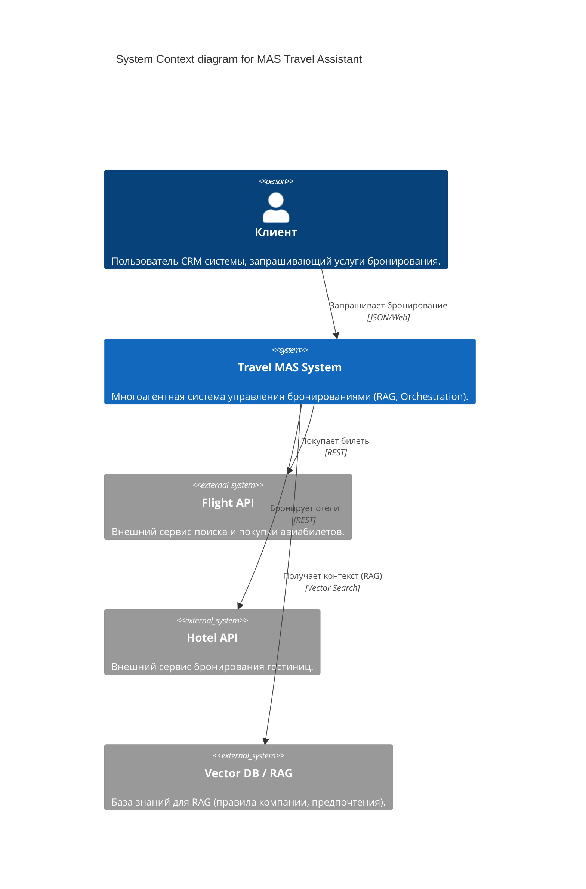
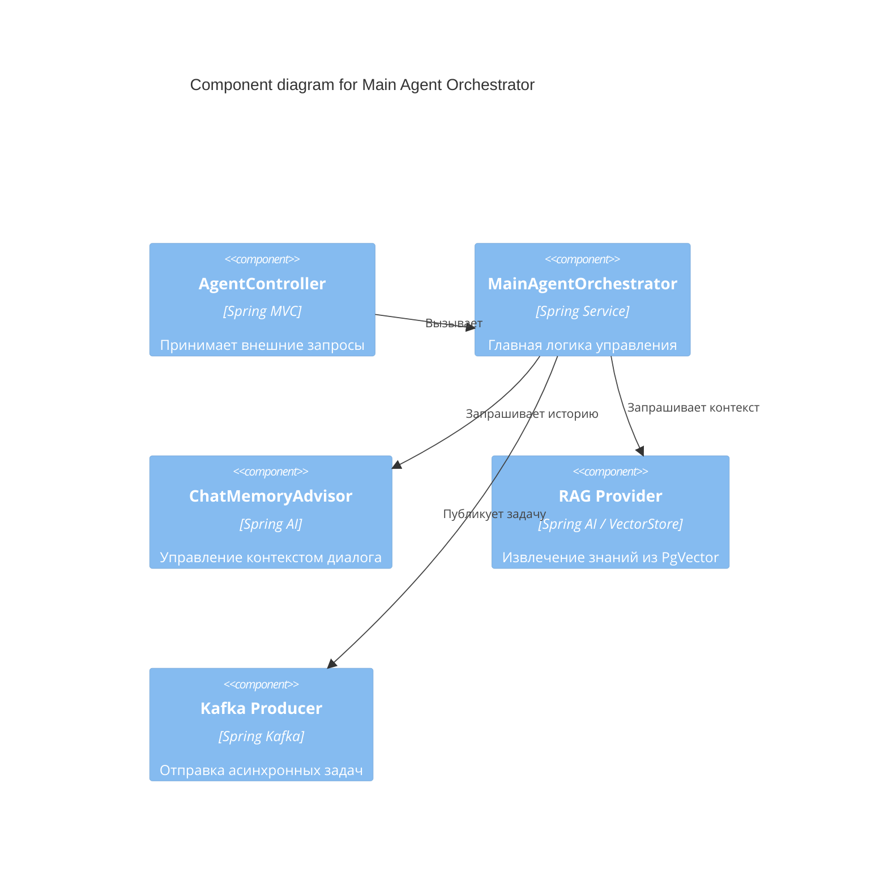

# Multi-Agent System (MAS) Architecture with RAG

Данный документ описывает архитектуру многоагентной системы (MAS) для автоматизации бронирования билетов и отелей с использованием RAG (Retrieval-Augmented Generation).

## C4 Model

### L1: System Context Diagram



### L2: Container Diagram (Final Enterprise Architecture)

```mermaid
C4Container
    title Container diagram for Media & Travel MAS (Enterprise Stack)

    Person(customer, "Клиент", "Пользователь системы")

    System_Boundary(mas_boundary, "MAS Enterprise System") {
        Container(orchestrator, "Main Agent (Orchestrator)", "Java/Spring AI", "Координация, Chat Memory, Routing")
        
        subgraph Media_MAS [Media Production Group]
            Container(script_agent, "Script Agent", "Hollywood Standards", "Сценарии")
            Container(image_agent, "Image Agent", "Stable Diffusion", "Визуалы")
            Container(video_agent, "Video Agent", "Luma AI Integration", "Видео")
            Container(motion_agent, "Motion Design Agent", "After Effects", "Анимация")
        }

        subgraph Infrastructure [Infrastructure Services]
            ContainerDb(postgres, "Postgres (pgvector)", "SQL + Vector", "Данные клиентов и Эмбеддинги для RAG")
            ContainerDb(redis, "Redis Stack", "In-memory", "Кэш, Chat Memory, Rate Limiting")
            Container(kafka, "Apache Kafka", "Message Broker", "Асинхронные медиа-пайплайны")
        }
    }

    System_Ext(luma_api, "Luma AI API", "Video Generation Service")
    System_Ext(external_tools, "External Tools", "ComfyUI, n8n, Zapier")

    Rel(customer, orchestrator, "Запрос (Web/REST)")
    Rel(orchestrator, redis, "История диалога / Кэш")
    Rel(orchestrator, postgres, "RAG (Семантический поиск)")
    
    Rel(orchestrator, kafka, "Событие: Старт медиа-пайплайна")
    Rel(kafka, script_agent, "Очередь: Задание на сценарий")
    Rel(script_agent, image_agent, "Очередь: Задание на визуал")
    
    Rel(video_agent, luma_api, "REST API: Генерация видео")
    Rel(orchestrator, external_tools, "Webhooks / API")
```

### L3: Component Diagram (Orchestrator & Agents)



## Инфраструктурные компоненты

### 1. Postgres (pgvector)
Используется как гибридная база данных:
- **Relational**: Хранение сущностей `Customer`.
- **Vector**: Хранение эмбеддингов для RAG. Позволяет агентам находить релевантную информацию по смыслу (cosine distance).

### 2. Redis Stack
Выполняет три роли:
- **Cache**: Ускорение доступа к частым запросам.
- **Chat Memory**: Хранение состояния диалога `MessageChatMemoryAdvisor`.
- **Queue Backup**: Резервное хранилище для промежуточных состояний агентов.

### 3. Apache Kafka
Обеспечивает надежную асинхронную связь. Медиа-пайплайн может быть длительным (генерация видео занимает минуты), поэтому Kafka позволяет не блокировать пользователя и обрабатывать задачи по мере готовности ресурсов.

## Принципы реализации (Best Practices)

1. **Tool Calling (Skills)**: Агенты не просто генерируют текст, а вызывают типизированные функции (скиллы).
2. **ReAct Pattern**: Агенты используют цикл Reason + Act для решения сложных задач.
3. **RAG Integration**: Главный агент получает информацию о предпочтениях клиента и политиках компании через векторный поиск перед принятием решений.
4. **Learning & Fine-tuning**: Возможность динамического добавления примеров (Few-shot learning) и дообучения через обратную связь.
5. **Failover**: Использование нескольких провайдеров AI (Groq, OpenAI) для отказоустойчивости.

## Добавление новых скиллов

Система спроектирована по принципу Open-Closed: новые умения добавляются через создание новых `Bean` с аннотацией `@Tool` (в Spring AI 1.0+) или через реализацию интерфейса `Function`.
